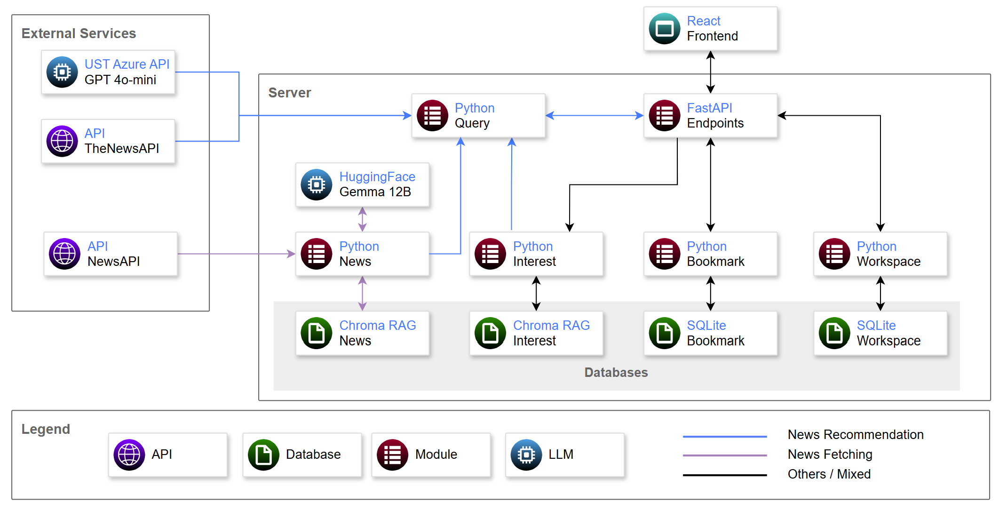

# RAG News Agent
This is a news recommendation web application that utilizes LLM and RAG to provide personalized news recommendation. It is designed to run locally following instructions at the  [Execution](#execution) section. An overview of the system and news recommendation architecture is provided in the [System Architecture](#system-architecture) section.

# Execution
1. Set up the environment files in both server and client directories.

- Server file: `server/src/.env`
  ```bash
  NEWS_API_KEY=<NEWS_API_KEY>
  THE_NEWS_API_KEY=<THE_NEWS_API_KEY>
  UST_API_KEY=<UST_API_KEY>
  HF_TOKEN=<HuggingFace_TOKEN>
  SERVER_HOST="localhost"
  SERVER_PORT=5000
  CLIENT_IP="http://localhost:5173"
  DEVICE="cpu"
  ```

- Client file: `client/.env`
  ```
  VITE_SERVER_IP="http://localhost:5000"
  ```
2. Fetch News
  - The system requires news in the local database to work. 
  - Please refer to the --help option for detailed arguments
    ```bash
    python -m src.utils.DataFetcher -e -hr 24 -m ust
    ```
3. Start the server
    ```bash
    cd server
    python -m src.main
    ```
4. Start the user interface
    ```bash
    cd client
    npm run dev
    ```
5. Visit the site at `localhost:5173`

# System Architecture


